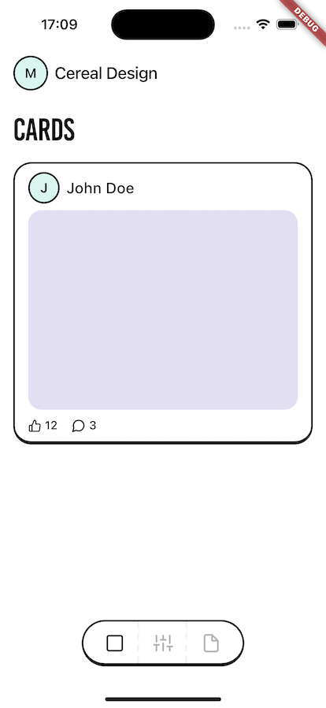

# Cereal Design System

Work in progress

Neo-brutalist design system for Flutter without ```package:material.dart``` dependency.



## Widgets
- CerealApp [X]
- CeralPage [X]
- AppBar [X]
- TabBar [X]
- SideBar
- Heading [X]
- Input
- Switch [X]
- TextButton [X]
- IconButton [X]
- SmallTextButton [X]
- SmallIconButton [X]
- Avatar [X]
- Card [X]
- Badge

## Utils
- PageRouter [X]
- Navigator
- ModalBottom
- Alert
- Theme [X]
- Colors [X]